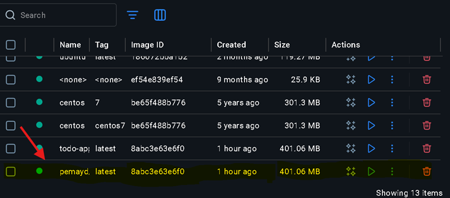
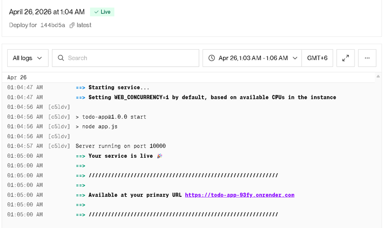

# CI/CD Pipeline Project (DSO101)

## GitHub Repository
[Paste your GitHub repo link here]

## Live Deployment (Render)
[Paste your Render app link here]

---

## Project Overview
This project demonstrates a complete CI/CD pipeline using a Node.js REST API.  
The system automates building, testing, containerization, and deployment using Docker, GitHub Actions, and Render.com.

## Technologies Used
- Node.js & Express
- Docker
- GitHub Actions
- DockerHub
- Render.com
- Jest & Supertest (Testing)

## Steps Taken
1. Created a Node.js REST API using Express  
2. Implemented CRUD operations for a to-do list  
3. Wrote automated tests using Jest and Supertest  
4. Created a Dockerfile to containerize the application  
5. Built and tested Docker image locally  
6. Pushed project to GitHub repository  
7. Created GitHub Actions workflow for CI/CD  
8. Configured DockerHub for image storage  
9. Set up Render.com service for deployment  
10. Connected GitHub Actions with Render using deploy hook  

## Challenges Faced
- Docker build errors during initial setup  
- Tests not exiting properly inside Docker  
- Authentication issues with DockerHub  
- Understanding GitHub Actions workflow syntax  
- Delay in Render deployment updates  

## Learning Outcomes
- Understood CI/CD pipeline workflow  
- Learned Docker containerization  
- Gained experience with GitHub Actions automation  
- Learned how to deploy applications using Render  
- Improved debugging and problem-solving skills  

## Screenshots

### GitHub Actions Workflow

### DockerHub Image

### Render Deployment

## 🧩 Project Structure
